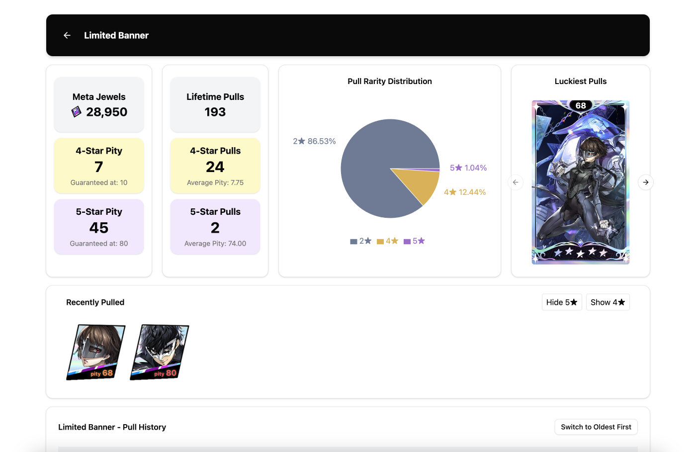

# P5X Wish Tracker

This is a [site](https://p5x.acrn.me) is made with React + TS + Vite that uses either [Tesseract.js](https://tesseract.projectnaptha.com/) Optical Character Recognition or [Iant's](https://github.com/iantCode) public API for returning pull history to save pull history to Google Spreadsheets. The site offers many different kinds of data visualization like:

- English and Korean name support
- 4/5 Star pity counts
- Jewels until pity counts
- List of most pulled characters
- List of luckiest pulls
- List of recently pulled 4 or 5 stars

To use the site, please ensure you have a new empty Google Sheets file to use (to-do: Add button for creating a new file to use), if you want to use the API to automatically grab your pulls, please use [Iant's Gacha Tools](https://iant.kr/gacha/) to grab the URL to use.

